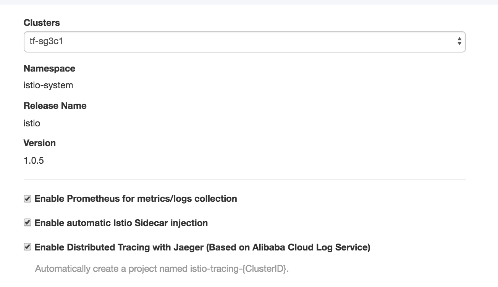
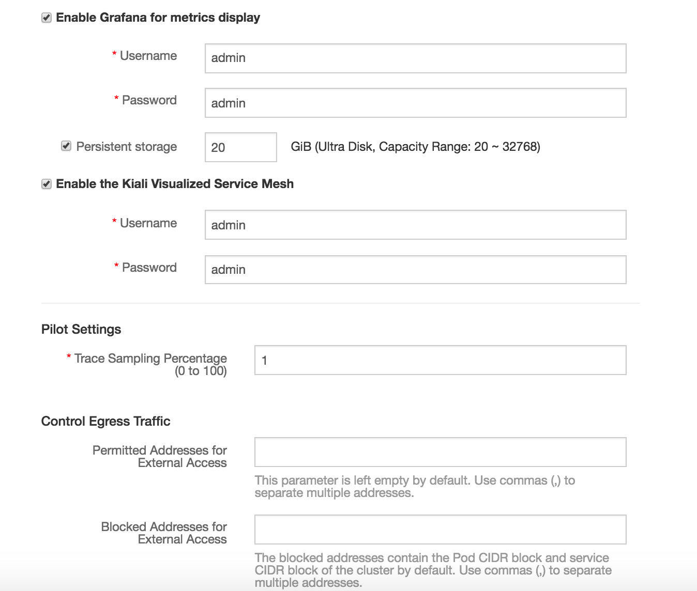
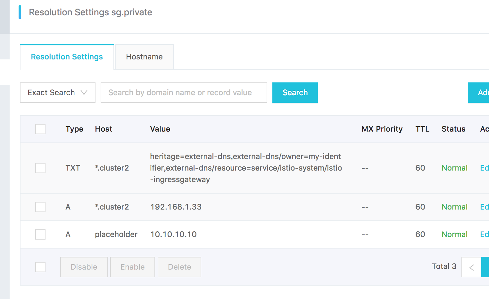

# Istio Clusters Ingress/Egress Lab


## Overview

By using Istio ServiceEntry and IngressGateway, we can connect services and applications in two different clusters. In this lab, we will show you how to do it.  We're going to build two kubernetes istio clusters, cluster1 and cluseter2. Applications running cluster1 access to service cluster2 via internal DNS domain name.  

## Create ACK clusters using terraform

### Setup terraform

Use terraform scripts to create two ACK managed clusters, each has three nodes. You can find the script in [tf](tf) directory.

```
$ cd tf
$ export ALICLOUD_ACCESS_KEY="<Your Alicloud Access Key>"
$ export ALICLOUD_SECRET_KEY="<Your Alicloud Secret Key>"
$ terraform init
```


Review variables in [tf/variables.tf](tf/variables.tf) and change to meet you requirements, for example, region, zone and ECS password, or kubernetes cluster name.

```
variable "region" {
  description = "Region to launch resources."
  default = "ap-southeast-1"
}

variable "availability_zone" {
  description = "The available zone to launch ecs instance and other resources."
  default     = "ap-southeast-1a"
}

variable "ecs_password" {
  description = "The password of instance."
  default     = "changeme"
}

variable "cluster_name" {
  default = "cluster"
}
```


You may also want to review and change DNS private zone settings.


```
resource "alicloud_pvtz_zone" "zone" {
    name = "sg.private"
}

resource "alicloud_pvtz_zone_record" "k8s" {
    zone_id = "${alicloud_pvtz_zone.zone.id}"
    resource_record = "placeholder"
    type = "A"
    value = "10.10.10.10"
    ttl="60"
}
```


### Create clusters and DNS private zone

```
$ terraform apply
```

Once it is finished, you will get two Kubernetes clusters, naming based on `${var.cluster_name}` setting. DNS private zone with name `${alicloud_pvtz_zone.zone.name}`


### Optional: remove clusters

```
$ terraform destroy
```


## Setup Istio and gateway domain name


### Deploy istio

In ACK console, click menu `clusters => cluster name "More" => Deploy Istio`, you will see wizard for deploy latest Istio into your cluster. Check the default settings and click `Deploy istio`.







###Enable external-dns feature of cluster2

By default, ACK clusters does not have external-dns installed. You have to do it manually. 


You will only need to install external-dns in cluster2, which means service/ingress ip address can be updated automatically in private dns.


Follow instructions in reference section, but use deployment file in [kubernetes/external-dns.yaml](kubernetes/external-dns.yaml) .

```
# Setup RAM policies
$ cd kubernetes
$ kubectl apply -f external-dns.yaml
```


### Change cluster2 gateway to VPC IP address and registered to private domain

Since we're going to demonstrate two clusters connected to each other using VPC, so it is better to replace default gateway IP from public to VPC IP address, and then register IP address to Private Domain


Do it in cluster2. Keep cluster1 unchanged.

```
$ cd kubernetes
# remove public ingressgateway
$ kubectl delete svc -n istio-system istio-ingressgateway
# create new one with private IP and registered IP to private-zone
$ kubectl apply -f istio-ingress-private-slb-external-dns.yaml
```


Find out cluster2 ingressgateway IP:

```
$ kubectl get svc istio-ingressgateway -n istio-system
NAME                   TYPE           CLUSTER-IP      EXTERNAL-IP    PORT(S)        AGE
istio-ingressgateway   LoadBalancer   172.23.13.196   192.168.1.33   80:31380/TCP   15s
```


Check Private Zone setting, you should see the IP address has been registered, like below:





### Deploy sample application and test


We would like to deploy tomcat to cluster1 istio, httpbin to cluster2 istio. Then within tomcat, using curl to access httpbin in cluster2.  In this lab, we create a namespace `istio-app` for istio applications, and set it auto inject sidecar.


Follow these instructions in cluster2, which has external-dns setup.

```
cd kuernetes
kubectl apply -f ns-istio-app.yaml
cd ../samples
kubectl apply -f httpbin.yaml
kubectl apply -f httpbin-gateway.yaml
kubectl apply -f httpbin-vs.yaml
```

Check httpbin is up and running

```
samples $ kubectl get deploy,service -n istio-app
NAME                            DESIRED   CURRENT   UP-TO-DATE   AVAILABLE   AGE
deployment.extensions/httpbin   1         1         1            1           2m

NAME              TYPE        CLUSTER-IP     EXTERNAL-IP   PORT(S)    AGE
service/httpbin   ClusterIP   172.23.2.128   <none>        8000/TCP   2m
```


Check gateway and virtual service are there.

```
samples $ kubectl get gateway,virtualservice -n istio-app
NAME                                          AGE
gateway.networking.istio.io/httpbin-gateway   22s

NAME                                         AGE
virtualservice.networking.istio.io/httpbin   14s
samples $
```


Follow these instructions in cluster1

```
cd kubernetes
kubectl apply -f ns-istio-app.yaml
kubectl apply -f tomcat-deployment.yaml
```


Make sure tomcat is autoinjected and up and running.

```
$ kubectl get po -n istio-app
NAME                     READY     STATUS    RESTARTS   AGE
tomcat-7666b9764-pcjfk   2/2       Running   0          1m
```


Exec to tomcat and curl httpbin service

```
$ kubectl get po -n istio-app
NAME                     READY     STATUS    RESTARTS   AGE
tomcat-7666b9764-pcjfk   2/2       Running   0          12m
$ kubectl exec -n istio-app -ti tomcat-7666b9764-pcjfk bash
```


Within tomcat, run curl to access httpbin service and result should be something like below:

```
$ curl -I http://httpbin.cluster2.sg.private/status/200
HTTP/1.1 200 OK
server: envoy
...
```


## Reference

External DNS tutorial: [https://github.com/kubernetes-incubator/external-dns/blob/master/docs/tutorials/alibabacloud.md](https://github.com/kubernetes-incubator/external-dns/blob/master/docs/tutorials/alibabacloud.md)


Tutorial in yunqi: [https://yq.aliyun.com/articles/633412](https://yq.aliyun.com/articles/633412)


Alibaba Terraform Provider: [https://www.terraform.io/docs/providers/alicloud/index.html](https://www.terraform.io/docs/providers/alicloud/index.html)


